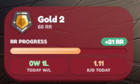

# Simple-VLR-Overlay

A simple Valorant OBS overlay for streams 
    <a href="https://pinguiino.github.io/Simple-VLR-Overlay/">https://pinguiino.github.io/Simple-VLR-Overlay/</a> 
     
    
    <h3>Stats:</h3>
    <b>-</b> Rank 
    <b>-</b> Total RR 
    <b>-</b> RR Gain/Loss 
    <b>-</b> Win/Loss 
    <b>-</b> KD Ratio 

 <h3>Credits:</h3>

<b>Powered by: </b>
    unofficial-valorant-api: <a href="https://github.com/Henrik-3/unofficial-valorant-api">https://github.com/Henrik-3/unofficial-valorant-api/</a>

<b>API KEY:</b>  (<i>Discord login required</i>): <a href="https://api.henrikdev.xyz/dashboard/">https://api.henrikdev.xyz/dashboard/</a>  

